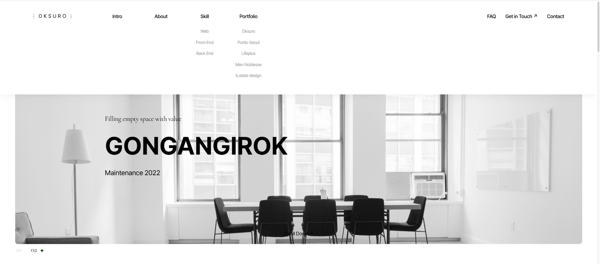

# 반응형 웹 UI 프로젝트 (Swiper & GSAP 기반)

**Swiper**와 **GSAP**, **Vanilla JavaScript**를 활용한 반응형 랜딩 페이지입니다.  
모바일과 데스크톱 모두에서 자연스럽고 부드러운 사용자 경험을 제공합니다.

<br/>

## 주요 기능

- 모바일/데스크탑 반응형 메뉴 구현
- Swiper 메인 비주얼 슬라이더
- 상품 슬라이드 (반응형 브레이크포인트 포함)
- 스크롤 트리거 애니메이션 (GSAP)
- 커스텀 마우스 커서 및 호버 이펙트
- 페이지 상단 이동 버튼
- 디바이스별 이미지 자동 교체 (PC/Mobile)

<br/>

## 🛠️ 사용 기술

| 기술 | 설명 |
|------|------|
| HTML5, CSS3 | 기본 마크업 및 스타일 |
| JavaScript | DOM 조작, Swiper, GSAP 연동 |
| [Swiper](https://swiperjs.com/) | 슬라이더 및 캐러셀 구현 |
| [GSAP + ScrollTrigger](https://gsap.com/docs/v3/Plugins/ScrollTrigger/) | 스크롤 애니메이션 |

<br/>

## ⚙️ 기능 상세 설명

### ✅ 데스크탑 - header 상호작용
- 데스크탑에서는 호버 시 `header.on` 클래스 부여 및 높이 애니메이션 적용
 

 ``` JavaScript
Array.from(gnbList).forEach(function(item1, i){
		item1.addEventListener("click", function(e){
			e.preventDefault();

			if(desktopFlag) return;

			if(item1.classList.contains("no-depth")) return;

			if(!item1.classList.contains("open")){
				Array.from(gnbList).forEach(function(item2, j){
					if(j == i){
						item2.classList.add("open");
					}
					else{
						item2.classList.remove("open");
					}
				});
			}
			else{
				item1.classList.remove("open");
			}
		});

		item1.addEventListener("mouseenter", function(){
			if(!desktopFlag) return;

			header.classList.add("on");
			header.style.height="300px";
		});

		item1.addEventListener("mouseleave", function(){
			if(!desktopFlag) return;

			header.classList.remove("on");
			header.removeAttribute("style");
		});
	});

export default App;
```

### ✅ 모바일 - header 상호작용
- 모바일에서 `.menu-open` 클래스로 메뉴 열림/닫힘 제어
- GNB는 모바일에서 하나만 열리도록 설정 <br/>
  
```
	menuTab.addEventListener("click", function(e){
		e.preventDefault();

		header.classList.toggle("menu-open");
	});

	dimmed.addEventListener("click", function(){
		header.classList.remove("menu-open");
	});
```

### ✅ Swiper 슬라이더
- **메인 슬라이더**: 페이드 효과, 자동 재생
  

- **상품 슬라이더**: 중앙 정렬, 브레이크포인트 대응
    

### ✅ GSAP 애니메이션
- `.main-typo`: 좌우로 자연스러운 스크롤 이동
- `.scale-ani`: 스크롤 위치에 따라 클래스 추가 및 확대 효과

### ✅ 커스텀 커서
- 마우스 위치를 따라 커서가 이동
- 특정 요소에 호버 시 원형 확장 효과

### ✅ 스크롤 탑 버튼
- 스크롤 시 `#page-top` 버튼이 표시되며 클릭 시 최상단 이동
