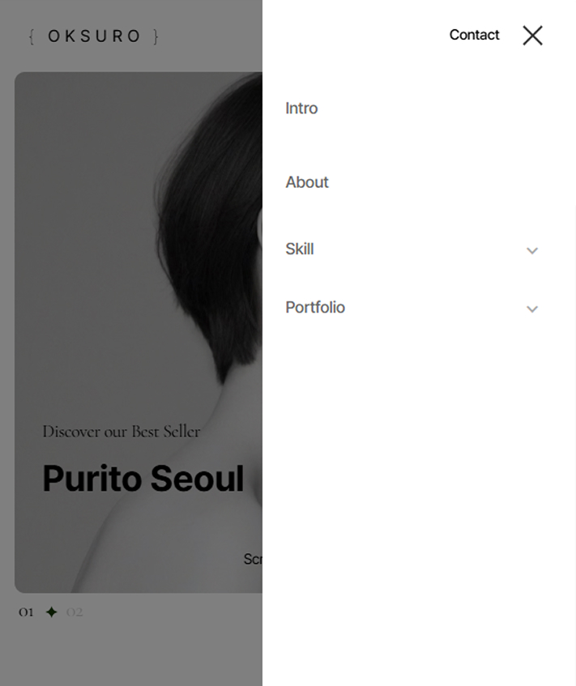
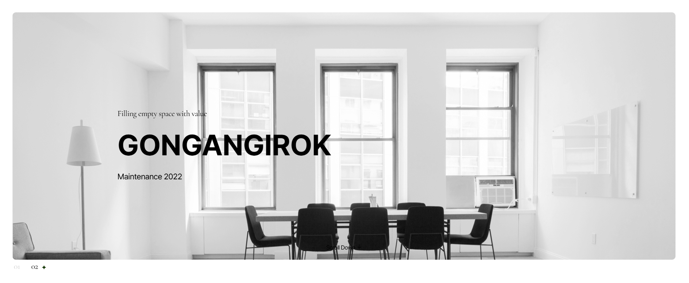
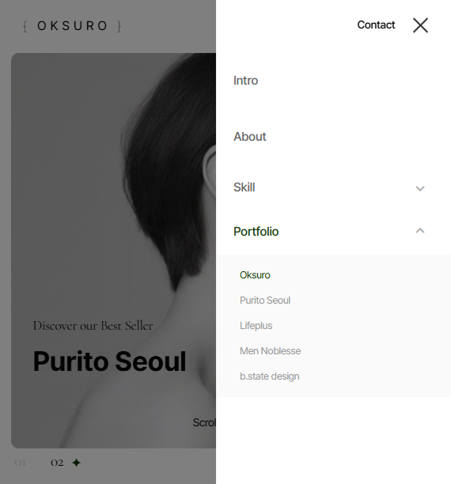
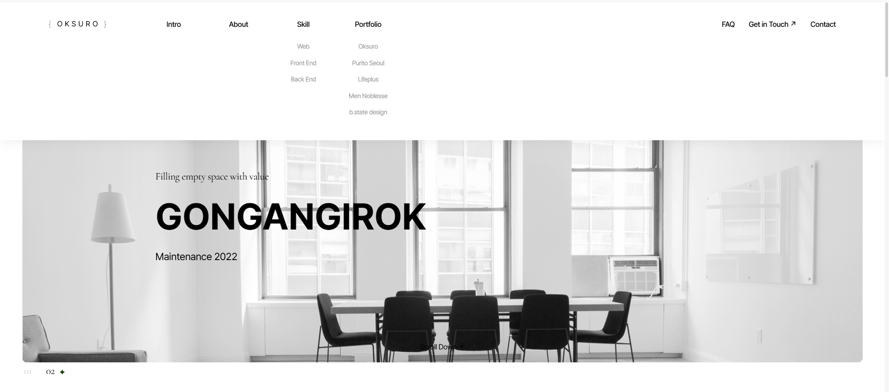
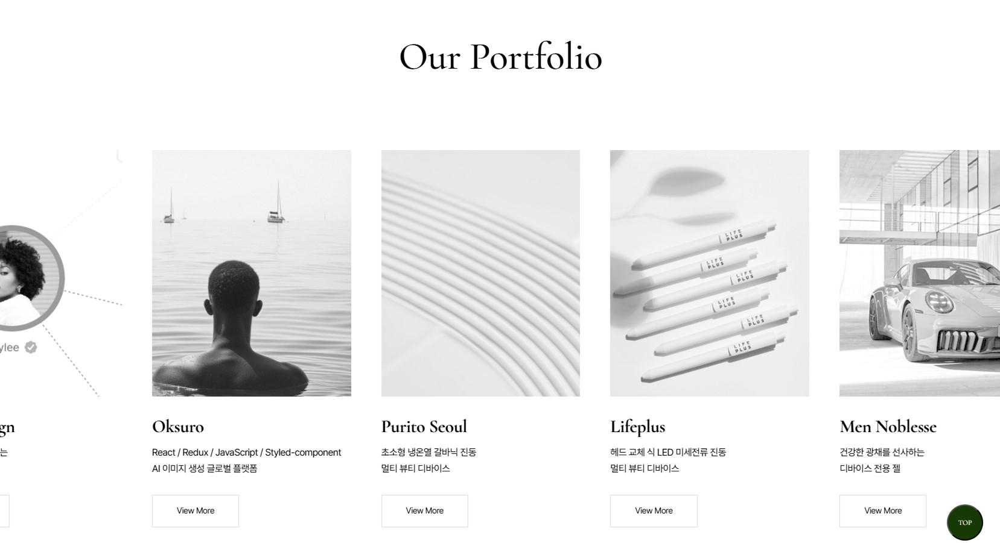
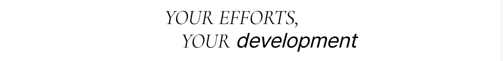
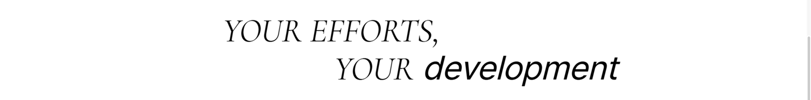
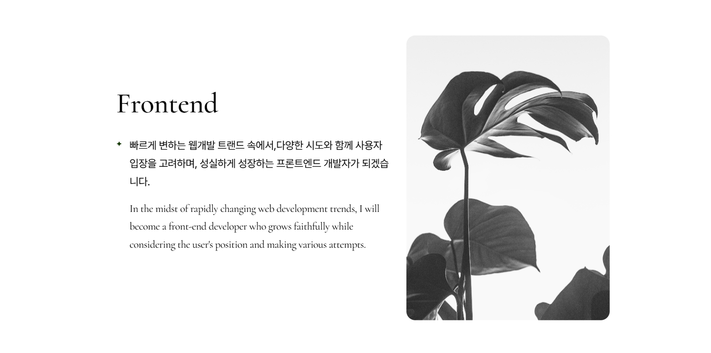

## 반응형 웹 UI 프로젝트 (Swiper & GSAP 기반)

Vanilla JavaScript, **Swiper**, **GSAP**를 기반으로 제작한 반응형 랜딩 페이지입니다.  
PC 및 모바일에서 자연스럽고 부드러운 사용자 경험을 제공합니다.

<br/>

### 🎯 주요 기능

- 반응형 메뉴 (모바일/데스크탑 구분)
- 메인 슬라이더 (Swiper 적용)
- 상품 슬라이드 (브레이크포인트 설정)
- 스크롤 트리거 애니메이션 (GSAP)
- 커스텀 마우스 커서 및 호버 효과
- Top 버튼 기능
- 디바이스별 이미지 자동 교체

<br/>

### 🛠️ 사용 기술

| 기술 | 설명 |
|------|------|
|  | HTML5 마크업 구조 |
|  | CSS3 반응형 스타일 처리 |
|  | JavaScript DOM 제어, Swiper & GSAP 연동 |
|  | Swiper.js 슬라이더 구현 |
|  | GSAP 고급 스크롤 애니메이션 |

<br/>

### 📸 데모 이미지

| 모바일 메뉴 | 메인 슬라이더 | 커스텀 커서 |
|-------------|----------------|-------------|
|  |  |  |


<br/>

### ⚙️ 기능 상세 설명

### ✅ 1. 화면 크기에 따라 모바일/데스크탑 여부 구분
- desktopFlag를 기준으로 모바일과 데스크탑을 구분합니다.
- 메뉴가 열려 있으면 닫고, 서브 메뉴도 초기화합니다.
- 초기 실행 시와 resize 이벤트 발생 시 호출합니다.

 ``` JavaScript
function checkWindowSize(){
	let winw = window.innerWidth;
	if(winw >= 1240){
		desktopFlag = true;
	} else {
		desktopFlag = false;
	}
	// 메뉴 상태 초기화
	if(header.classList.contains("menu-open")){
		header.classList.remove("menu-open");
	}
	// 서브메뉴 초기화
	Array.from(gnbList).forEach(function(item){
		item.classList.remove("open");
	});
}
```

---

### ✅ 2. 모바일 -메뉴 버튼 클릭 시 전체 메뉴 열기/닫기

- 모바일에서는 `.menu-open` 클래스를 통해 전체 메뉴의 열림/닫힘을 제어합니다.  
- GNB는 하나의 메뉴만 열리도록 구성되어 있어 사용성이 향상됩니다.


```javascript
menuTab.addEventListener("click", function(e){
	e.preventDefault();
	header.classList.toggle("menu-open");
});
```

+ 전체 메뉴 바깥 클릭 시 닫기 (dimmed 처리)
```javascript
dimmed.addEventListener("click", function(){
	header.classList.remove("menu-open");
});
```

---

### ✅  3. 2depth 메뉴 열고 닫기 (모바일 전용)

- 모바일일 때만 작동됩니다.
- 이미 열린 메뉴 외에는 모두 닫고, 클릭한 메뉴만 열립니다.



```javascript
Array.from(gnbList).forEach(function(item1, i){
	item1.addEventListener("click", function(e){
		e.preventDefault();
		if(desktopFlag) return;
		if(item1.classList.contains("no-depth")) return;

		if(!item1.classList.contains("open")){
			Array.from(gnbList).forEach(function(item2, j){
				if(j == i){
					item2.classList.add("open");
				} else {
					item2.classList.remove("open");
				}
			});
		} else {
			item1.classList.remove("open");
		}
	});
});
```

---

### ✅ 4. GNB 메뉴 호버 시 메뉴 열림(PC 전용)

- 메뉴 hover 시 헤더 높이 증가(=메뉴 열림), 마우스가 빠져나가면 원복합니다.



```javascript
item1.addEventListener("mouseenter", function(){
	if(!desktopFlag) return;
	header.classList.add("on");
	header.style.height = "300px";
});

item1.addEventListener("mouseleave", function(){
	if(!desktopFlag) return;
	header.classList.remove("on");
	header.removeAttribute("style");
});
```

---

### ✅ 5. 이미지 백그라운드 JS로 넣기 (반응형)

- 반응형을 목적으로 .pc, .mobile 요소 각각에 JS로 backgroundImage 삽입합니다.


```javascript
const imageData = [
	{ pc: "visual_pc1.jpg", mobile: "visual_mobile1.jpg" },
	{ pc: "visual_pc2.jpg", mobile: "visual_mobile2.jpg" }
];

let swiperSlides = document.querySelectorAll(".main-slider .swiper-slide");

swiperSlides.forEach(function(item, i){
	let pc = item.querySelector(".pc");
	let mobile = item.querySelector(".mobile");

	pc.style.backgroundImage = `url(images/${imageData[i].pc})`;
	mobile.style.backgroundImage = `url(images/${imageData[i].mobile})`;
});
```

---

### ✅ 6. 메인 Swiper

- 페이드 효과가 적용된 루프형 메인 슬라이더입니다.


```javascript
new Swiper(".main-slider .mainSwiper", {
	loop: true,
	speed: 1000,
	effect: "fade",
	fadeEffect: { crossFade: true },
	autoplay: { delay: 5000 },
	pagination: {
		el: ".main-slider .swiper-pagination",
		clickable: true,
		renderBullet: function(index, className){
			return `<span class="${className}">0${index+1}</span>`;
		}
	}
});
```

---

### ✅ 7. 다중 Swiper

- 반응형으로 슬라이드 수가 바뀌는 다중 슬라이더입니다.
- autoplay가 적용되어 있어 기본적으로 자동으로 넘어가는 형태입니다.



```javascript
const productSwiper = new Swiper(".main-product .productSwiper", {
	loop: true,
	speed: 2000,
	slidesPerView: 1.5,
	centeredSlides: true,
	spaceBetween: 20,
	autoplay: { delay: 2000 },
	breakpoints: {
		769: {
			slidesPerView: 3,
			spaceBetween: 20
		},
		1025: {
			slidesPerView: 4.5,
			spaceBetween: 50
		}
	}
});
```

---

### ✅ 8. 텍스트를 좌우로 움직이는 애니메이션(GSAP)

- .main-typo 내부 텍스트 요소를 좌우로 움직이게 해 사용자의 시선을 끕니다.




```javascript
function checkDevice(){
	if(window.matchMedia("(max-width: 768px)").matches){
		if(device == "mobile") return;
		device = "mobile";
		xoffset = 7;
	} else {
		if(device == "pc") return;
		device = "pc";
		xoffset = 15;
	}

	gsap.utils.toArray(".main-typo").forEach(function(item){
		const tl = gsap.timeline({
			scrollTrigger: {
				trigger: item,
				scrub: 1,
				start: "top bottom"
			}
		});

		tl.to(item.querySelector("div:nth-child(1)"), {
			x: -1 * xoffset + "%",
			duration: 1
		});
		tl.to(item.querySelector("div:nth-child(2)"), {
			x: xoffset + "%",
			duration: 1,
			delay: -1
		});
	});
}
```

---

### ✅ 9. 특정 페이지 영역 진입 시 이미지 스케일 조절 (GSAP)

- .scale-ani 요소가 화면 안에 들어오면 .active 클래스 추가 및 제거(scale(0.8) <-> scale(1.5))합니다.



```javascript
gsap.utils.toArray(".scale-ani").forEach(function(item){
	gsap.timeline({
		scrollTrigger: {
			trigger: item,
			start: "top bottom",
			end: "bottom top",
			onEnter: function(){
				item.classList.add("active");
			},
			onLeave: function(){
				item.classList.remove("active");
			},
			onLeaveBack: function(){
				item.classList.remove("active");
			}
		},
		delay: 2
	});
});
```

---

### ✅ 10. 마우스 따라다니는 커서

- 마우스 움직임에 따라 .custom-cursor, .custom-cursor-text가 따라다니게 설정했습니다.


```javascript
document.body.addEventListener("mousemove", function(e){
	gsap.to("#custom-cursor, #custom-cursor-text", {
		x: e.clientX,
		y: e.clientY,
		duration: 1.2,
		ease: Power3.easeOut
	});
});
```

+ hover 시 텍스트와 원이 커짐

- .custom-hover에 마우스가 올라가면 애니메이션 효과가 발생합니다.

```javascript
customHover.forEach(function(item){
	item.addEventListener("mouseenter", function(){
		gsap.to(".custom-hover-circle, .custom-hover-text", {
			width: "100%",
			height: "100%",
			opacity: 1,
			duration: 0.3,
			ease: Power3.easeOut
		});
	});

	item.addEventListener("mouseleave", function(){
		gsap.to(".custom-hover-circle, .custom-hover-text", {
			width: 0,
			height: 0,
			opacity: 0,
			duration: 0.3,
			ease: Power3.easeOut
		});
	});
});
```

---

### ✅ 11. page-top 버튼 보이기 / 숨기기
- window.scrollY가 내려가면 #page-top 버튼이 나타남.


```javascript
window.addEventListener("scroll", function(){
	let winH = window.innerHeight;
	if(window.scrollY > winH){
		pageTop.classList.add("show");
	} else {
		pageTop.classList.remove("show");
	}
});
```

+ page-top 버튼 클릭 시 부드러운 이동 (GSAP)

- 클릭 시 맨 위로 스무스하게 스크롤됩니다.

```javascript
pageTop.addEventListener("click", function(){
	gsap.to(window, { scrollTo: 0, duration: 0.3, ease: Power3.easeOut });
});
```
